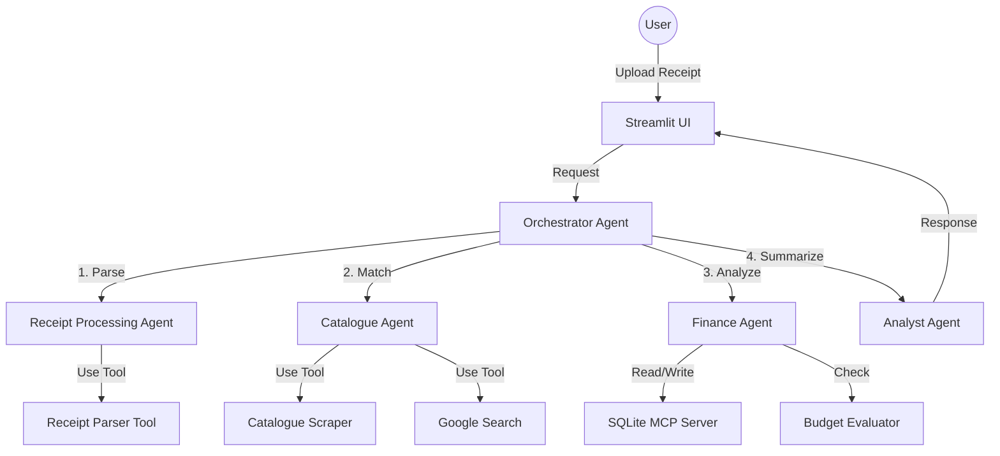

# SmartSpendGrocery - System Walkthrough

This document provides a comprehensive walkthrough of the **SmartSpendGrocery** agentic system, detailing its architecture, user flow, and technical implementation using Google ADK.

## System Overview
SmartSpendGrocery is an intelligent financial assistant that automates the tracking of grocery expenses. It uses a multi-agent architecture to parse receipts, match items to a product catalogue, and provide personalized budgeting insights.

## Architecture

The system follows a **Hub-and-Spoke Multi-Agent** pattern.

## User Journey

### 1. Receipt Upload
The user opens the Streamlit app and uploads a photo or text of their Albert Heijn receipt.
*   **Input**: Image/Text file.
*   **Agent Action**: `Orchestrator` receives the file and delegates to `ReceiptProcessingAgent`.

### 2. Item Extraction
The `ReceiptProcessingAgent` uses OCR and LLM reasoning to extract raw text.
*   **Challenge**: Shorthand text like "BAP WIT".
*   **Result**: JSON list of raw items `[{"name": "BAP WIT", "price": 1.79}, ...]`.

### 3. Catalogue Matching
The `CatalogueAgent` takes the raw items and finds their full product details.
*   **Action**: Scrapes AH website or uses Embeddings to match "BAP WIT" to "Bananas White".
*   **Tooling**: Uses `CatalogueScraper` and `ProductMatcher`.
*   **Long-Running**: If items are ambiguous, the agent might pause to ask the user: *"Is 'BAP' Bananas or Bapao?"*

### 4. Budget Check
The `FinanceAgent` records the transaction and checks against budgets.
*   **Memory**: Updates the `SQLite` database via **MCP**.
*   **Logic**: Checks if the "Fruit" category budget is exceeded.
*   **Output**: Alert flags (e.g., `warning: true, message: "Over budget by €2"`).

### 5. Insight Generation
The `AnalystAgent` synthesizes all data into a helpful summary.
*   **Context**: Uses **Context Compaction** to fit monthly history into the prompt.
*   **Output**: *"You spent €15 on fruit this week. That's €2 over your budget, mainly due to the organic bananas."*

## Technical Deep Dive

### Google ADK Concepts Used

#### 1. Multi-Agent System
We use specialized agents to separate concerns. The `Orchestrator` manages the flow, while `CatalogueAgent` handles the messy web scraping logic.

#### 2. Tools & MCP
*   **MCP**: We use a Model Context Protocol server to expose the SQLite database. This allows any agent to query spending history in a standardized way.
*   **Custom Tools**: Python-based tools for specific logic like `BudgetEvaluator`.

#### 3. Observability
We use ADK's tracing to monitor the lifecycle of a receipt.
*   **Trace**: `Upload -> Parse (2s) -> Match (5s) -> DB Update (0.1s) -> Response`.
*   **Metrics**: We track the "Match Confidence" to identify when the catalogue scraper needs updating.

#### 4. Sessions & Memory
*   **InMemorySession**: Holds the state of the current receipt being processed.
*   **Memory Bank**: The SQLite DB acts as the long-term memory bank, allowing the agent to answer questions like *"How much did I spend on milk last year?"*.

## Demo Script (Short)

**User**: *Uploads receipt*
**System**: "Processing receipt..."
**(Internal)**: `ReceiptProcessingAgent` extracts items. `CatalogueAgent` matches 'AH BIO MLK' to 'Organic Milk'.
**System**: "I've processed your receipt. You bought Milk and Bread. This brings your Dairy spending to €12 this month, which is within your budget."
**User**: "How am I doing on snacks?"
**System**: "You've spent €25 on snacks this month. You have €5 remaining in your budget."
